# Self-Driving Car Project 5. Vehicle Detection

## Overview
In this project, my goal is to write a pipeline to detect vehicles in a video.

The test data includes two videos test_video.mp4 and a full project_video.mp4.  

## Project Details
The steps of this project are the following:

* Perform a Histogram of Oriented Gradients (HOG) feature extraction on a labeled training set of images and train a Linear SVM classifier
* Optionally, apply a color transform and append binned color features, as well as histograms of color, to the HOG feature vector
* Note: for the first two steps I will try to normalize the features and randomize a selection for training and testing
* Implement a sliding-window technique and use my trained classifier to search for vehicles in images
* Run the pipeline on a video stream and create a heat map of recurring detections frame by frame to reject outliers and follow detected vehicles
* Estimate a bounding box for vehicles detected

Here are links to the labeled data for [vehicle](https://s3.amazonaws.com/udacity-sdc/Vehicle_Tracking/vehicles.zip) and [non-vehicle](https://s3.amazonaws.com/udacity-sdc/Vehicle_Tracking/non-vehicles.zip) examples to train a classifier. These example images come from a combination of the [GTI vehicle image database](http://www.gti.ssr.upm.es/data/Vehicle_database.html), the [KITTI vision benchmark suite](http://www.cvlibs.net/datasets/kitti/), and examples extracted from the project video itself. We can also try to take advantage of the recently released [Udacity labeled dataset](https://github.com/udacity/self-driving-car/tree/master/annotations) to augment the training data.  

Some example images for testing the pipeline on single frames are located in the `test_images` folder. I will produce and save examples of the output from each stage of my pipeline in the folder called `ouput_images`. The video called `project_video.mp4` is the video my pipeline will work well on.

## Histogram of Oriented Gradients (HOG)

### 1. HOG Features Extraction

The code for this step is contained in the code sections 1 - 3 of the IPython notebook "./carnd-vehicle-detection-project.ipynb" or "./carnd-vehicle-detection-project.html". 

I started by reading in all the `vehicles` and `non-vehicles` images.  Here is an example of one of each of the `vehicles` and `non-vehicles` classes:

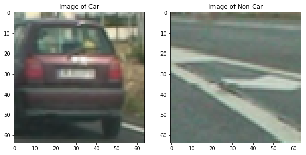

I then explored different color spaces and different `skimage.hog()` parameters (`orientations`, `pixels_per_cell`, and `cells_per_block`).  I grabbed random images from each of the two classes and displayed them to get a feel for what the `skimage.hog()` output looks like.

Here is an example using the `YUV` color space and HOG parameters of `orientations=15`, `pixels_per_cell=(8, 8)` and `cells_per_block=(2, 2)`:

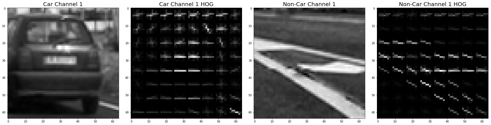

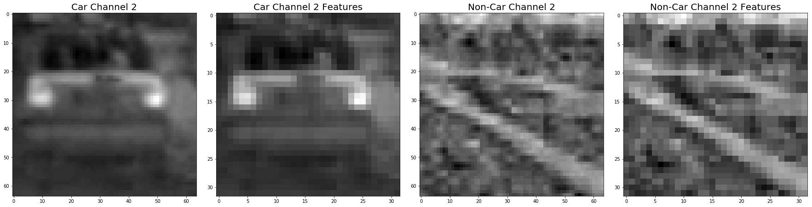


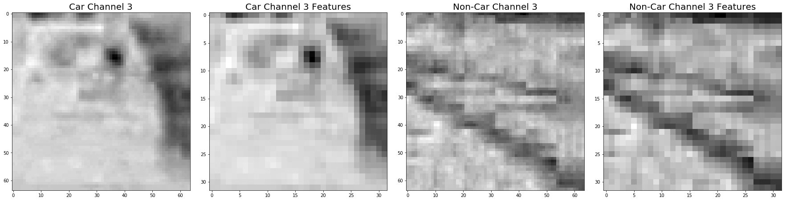


### 2. Feature Extraction Parameters

I tried various combinations of parameters in the experiments trying to maximize the model accuracy and minimize the fitting time. In the end I used the following as the final parameters in the code sections 3 of the IPython notebook "./carnd-vehicle-detection-project.ipynb" or "./carnd-vehicle-detection-project.html":

| Parameter           | Value          |
| ------------------- | -------------- |
| Color Space         | YUV            |
| HOG Orientations    | 15             |
| HOG Pixels per cell | 8              |
| HOG Cell per block  | 2              |
| HOG Channels        | All            |
| Spatial bin size    | (32, 32)       |
| Histogram bins      | 32             |
| Histogram range     | (0, 256)       |
| Classifier          | LinearSVC      |
| Scaler              | StandardScaler |

### 3. Train the Classifier

With the above parameters, it took a few seconds to train the classifier and the final accuracy was 98.73%. The related code is in code sections 6 - 8 of the IPython notebook "./carnd-vehicle-detection-project.ipynb" or "./carnd-vehicle-detection-project.html". Here is a report from the data preparation and classifier training:

```
Feature Extraction Report:
	Feature Extraction Time: 15.05(seconds)
	Orientations: 15
	Pixels Per Cell: 8
	Cells Per Block: 2

SVC Training Report:
	Lenth of the Feature Vectors: 11988
	Data Generation Time: 2.23(seconds)
	Training Time: 1.27(seconds)
	Test Accuracy: 0.9873
```

## Sliding Window Search

### 1. Sliding Window Search Implementation

Here was my approaches to implement sliding windows search:

* Calculate the search windows
* Apply the feature extraction to each one of windows to find the one that contains a car
* Found the right scales and overlap parameter by experimenting

The implementation is in code section 9 of the IPython notebook "./carnd-vehicle-detection-project.ipynb" or "./carnd-vehicle-detection-project.html".

Ultimately I searched on a few scales using YUV 3-channel HOG features plus spatially binned color and histograms of color in the feature vector, which provided a nice result.  The following image is an example to show the result:

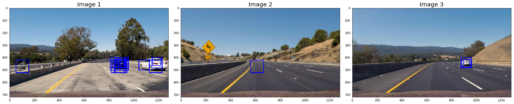

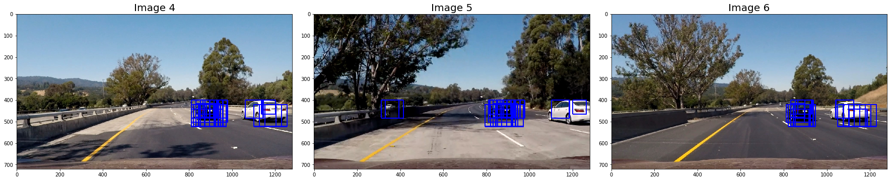

## Video Implementation

### 1. Combining Overlapping Bounding Boxes and Filter out False Positives

I recorded the positions of positive detections in each frame of the video.  From the positive detections I created a heatmap and then thresholded that map to identify vehicle positions.  I then used `scipy.ndimage.measurements.label()` to identify individual blobs in the heatmap.  I then assumed each blob corresponded to a vehicle. I constructed bounding boxes to cover the area of each blob detected.

The implementation is in code sections 11 - 13 of the IPython notebook "./carnd-vehicle-detection-project.ipynb" or "./carnd-vehicle-detection-project.html".

Here's an example result showing the corresponding heatmaps of the six test images:

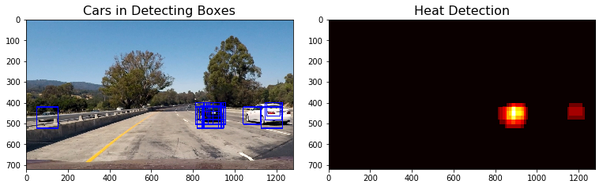

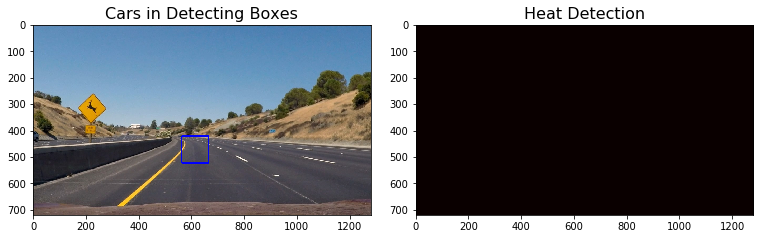

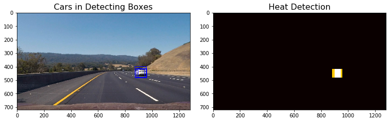

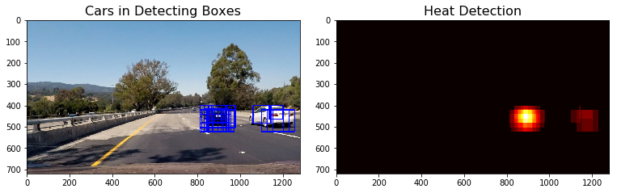

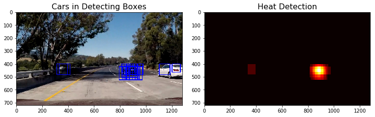

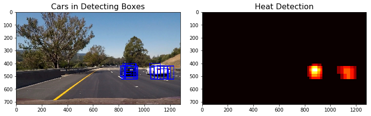

Here is the output of the integrated heatmap and the resulting bounding boxes (implemented in code sections 11 and 14 of the IPython notebook "./carnd-vehicle-detection-project.ipynb" or "./carnd-vehicle-detection-project.html"):

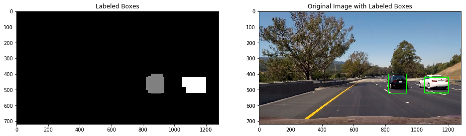

### 2. Final Video Output
Here is the final video output **"./project_video_output.mp4"**.

## Discussion

### Briefly Discussion on the Implementation

* It took a little bit too long to use the pipeline to detect the cars and produce the videos, there is still space to improve the performance of the pipeline, for example, we could try to decrease the amount of space to search
* To improve the heatmap processing, using more than one scale could be useful to find the windows and apply them on the heatmap
* The final bounding box is not a close wrap of the car, it includes some space that doesn't belong to the car. We could try some other different shapes or threshold values to shrink the bounding box a little bit so that it can closely wrap the car
* We can try to use convolutional neural network to produce the sliding window search altogether
